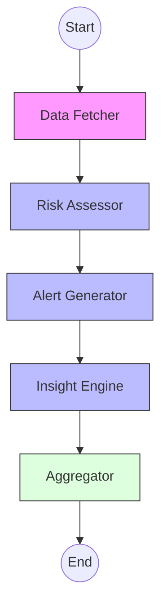

# Portfolio Analyzer 📈🤖

An AI-powered cryptocurrency portfolio analysis engine built with **Python**, **LangGraph**, and **Google Gemini**. This service provides deep insights into portfolio risk, technical indicators, and strategic recommendations for crypto investors.

## 🚀 Overview

The Portfolio Analyzer is a backend microservice designed to ingest portfolio data and transactions, then run them through a sophisticated multi-stage analysis pipeline (DAG) using LangGraph. It combines traditional quantitative finance (technical indicators) with state-of-the-art Generative AI to provide a comprehensive "financial check-up."

### Key Features

- **Dynamic Data Fetching**: Retrieves real-time OHLCV and market data from **CoinGecko** for over 13,000+ coins.
- **Quantitative Indicators**: Calculates RSI, MACD, and Bollinger Bands using `pandas` and the `ta` library.
- **AI Risk Assessment**: Uses **Google Gemini** to generate structured risk scores, concentration analysis (HHI), and volatility assessments.
- **Smart Alerts**: Automatically identifies overbought/oversold conditions, stop-loss triggers, and take-profit opportunities.
- **Strategic Insights**: Provides actionable recommendations based on diversification and current market trend alignment.
- **Graph-Based Pipeline**: Built with **LangGraph** for resilient, state-managed execution flows.

---

## 🏗️ Architecture

The analysis follows a directed acyclic graph (DAG) structure:



1.  **fetch_market_data**: Ingests the portfolio and fetches current prices and history.
2.  **risk_assessor**: First LLM pass to determine overall risk score and PnL analysis.
3.  **alert_generator**: Second LLM pass focusing on technical triggers and volatility.
4.  **insight_engine**: Final LLM pass providing human-readable strategic summaries and recommendations.
5.  **aggregator**: Merges all findings into a single, structured JSON payload.

---

## 🛠️ Technology Stack

- **Python 3.10+**
- **FastAPI**: High-performance API framework.
- **LangGraph**: Orchestration Framework for the analysis pipeline.
- **Google Generative AI (Gemini)**: The core "brain" for qualitative analysis.
- **CoinGecko API**: Real-time market data source.
- **Pandas & ta**: Numerical analysis and technical indicators.
- **Uvicorn**: ASGI server for deployment.

---

## 🚦 Getting Started

### Prerequisites

- Python 3.10 or higher.
- A **Google Gemini API Key**.
- (Optional) A **CoinGecko API Key** (Demo key works fine).

### Installation

1.  **Clone the repository**:
    ```bash
    git clone https://github.com/ah2909/FM-analyze.git
    cd portfolio-analyzer
    ```

2.  **Create a virtual environment**:
    ```bash
    python -m venv venv
    source venv/bin/activate  # On Windows: venv\Scripts\activate
    ```

3.  **Install dependencies**:
    ```bash
    pip install -r requirements.txt
    ```

4.  **Configure Environment Variables**:
    Copy `.env.example` to `.env` and fill in your keys:
    ```bash
    cp .env.example .env
    ```
    Required keys:
    - `GEMINI_API_KEY`: Your Google AI API key.
    - `PORT`: (Default: 7070)

### Running the Server

Start the application with:
```bash
python server.py
```
The API will be available at `http://localhost:7070`.

---

## 📡 API Documentation

### Analyze Portfolio
**Endpoint**: `POST /api/analyze`

**Request Body**:
```json
{
  "user_id": "user_123",
  "portfolio": [
    { "symbol": "BTC", "amount": 0.5, "avg_price": 55000 },
    { "symbol": "ETH", "amount": 2.5, "avg_price": 2800 }
  ],
  "transactions": [
    { "symbol": "BTC", "type": "buy", "quantity": 0.5, "price": 55000, "date": "2024-01-01" }
  ]
}
```

**Response**:
A detailed JSON object containing `risk_assessment`, `alerts`, `insights`, and `metadata`.

---

## 📝 License

This project is licensed under the MIT License.
